# Docker-Microservice
Deploy a Software with Microservice Architecture via Docker

<div dir="rtl">

## روال انجام آزمایش

ابتدا از نصب بودن داکر بر روی سیستم خود اطمینان حاصل می‌کنیم.

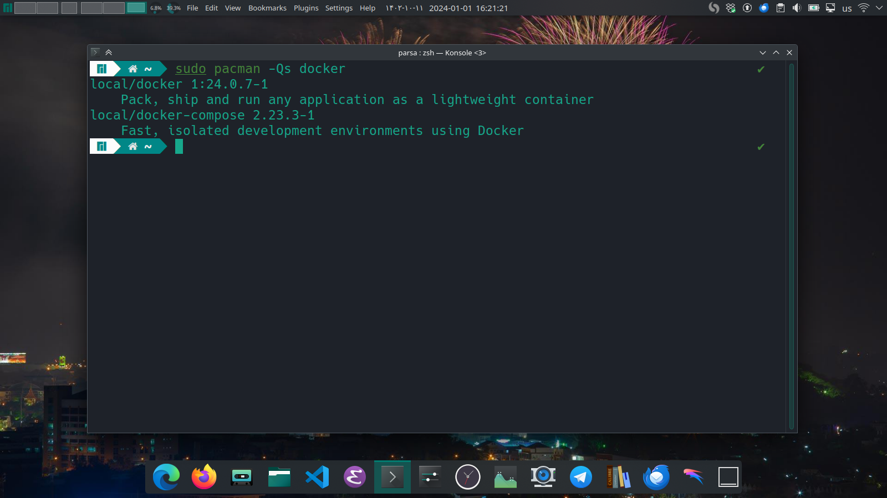

حال با دستور زیر یک پروژه 
Web API
با استفاده از
.NET
ایجاد می‌کنیم.

```bash
mkdir CRUD-Service
dotnet new webapi -o Converter-Service 
```

کدهای مربوطه در این پروژه برای خواندن، نوشتن، بروزرسانی و حذف داده از دیتابیس 
PostgreSQL
نوشته شده‌اند. حال به سراغ 
containerize 
کردن پروژه می‌رویم. برای این کار داکرفایل زیر را می‌نویسیم. 

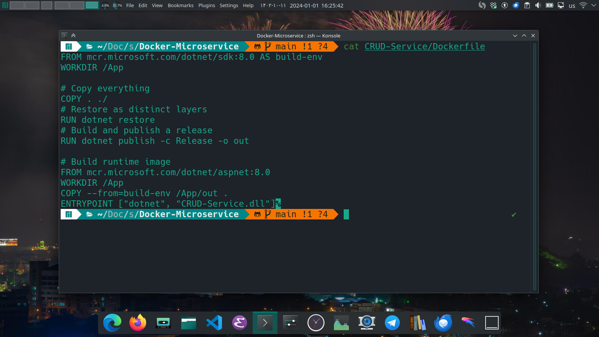

در این فایل ابتدا با استفاده از ایمیجی که دارای 
DotNet SDK
است، پروژه را بیلد می‌کنیم سپس فایل‌های بیلد شده را به ایمیجی که دارای 
DotNet Runtime
است منتقل می‌کنیم. این کار برای سبک‌تر شدن ایمیج نهایی است. در ادامه باید داکر کامپوز مربوط به این سرویس و دیتابیس را بنویسیم. 

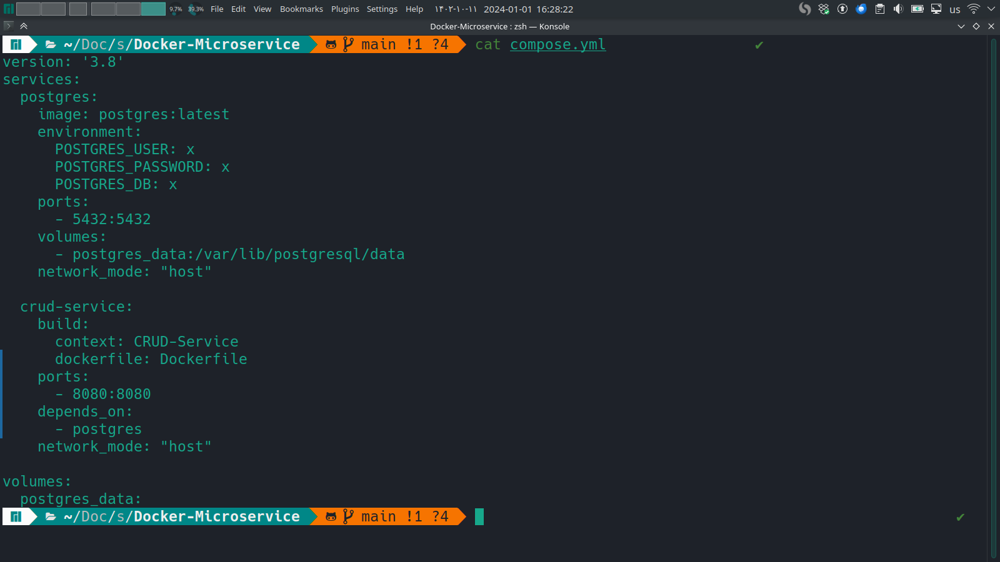

همانطور که مشاهده می‌کنیم ابتدا ورژن کامپوز مشخص شده، سپس قسمت مربوط به دیتابیس را مشاهده می‌کنیم و پس از آن قسمت مربوط به ماکروسرویس اول. در آخر والیوم‌های مورد نیاز معرفی شده‌اند. با دستور زیر کانتینرها را ساخته و اجرا می‌کنیم. 

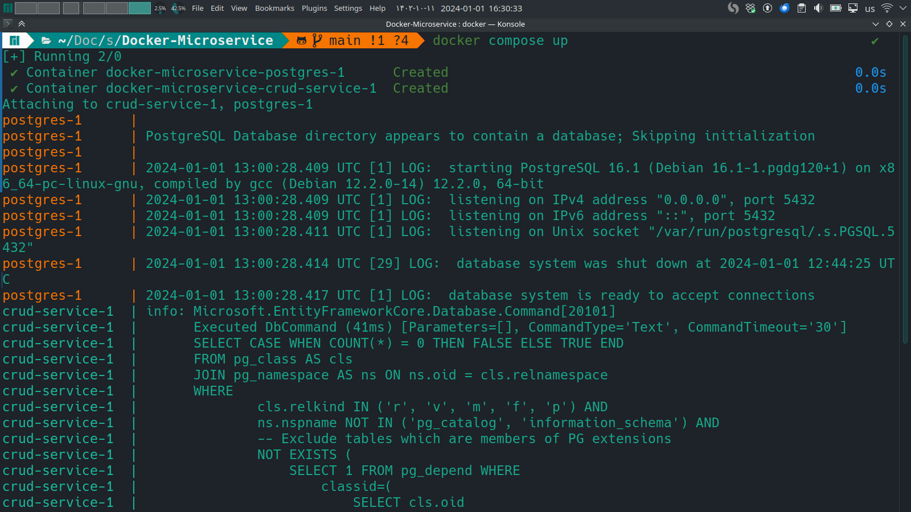

حال مشاهده می‌کنیم در مرورگر به درستی درخواست ارسال می‌شود. 

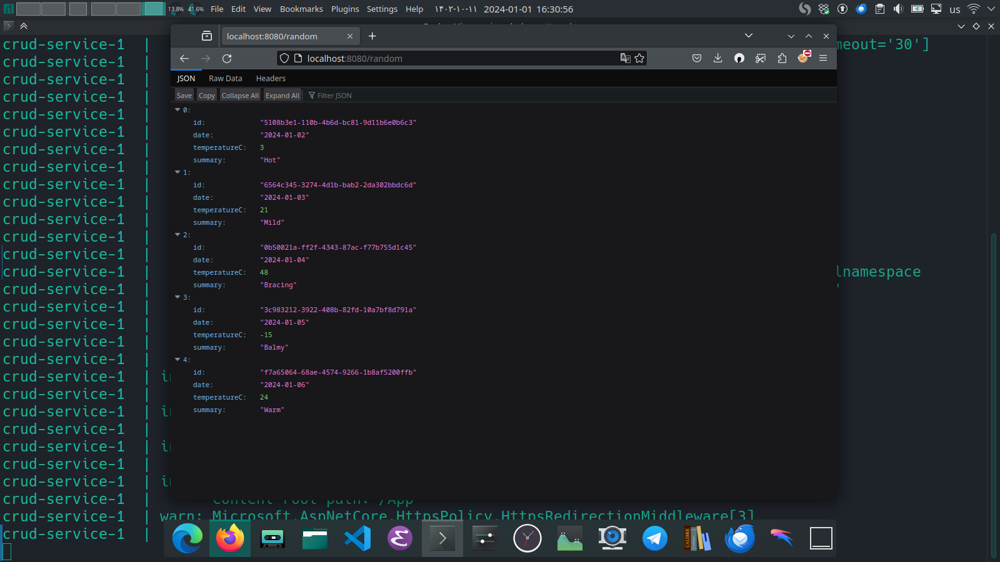

در تصویر زیر ایمیج‌ها و کانتینرهای ایجاد شده را مشاهده می‌کنیم. 

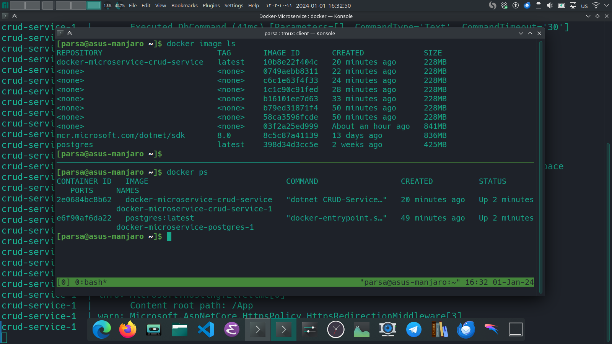

برای تست صحت عملکرد میکروسرویس از curl استفاده می‌کنیم. 
ابتدا تمام داده را پاک می‌کنیم.

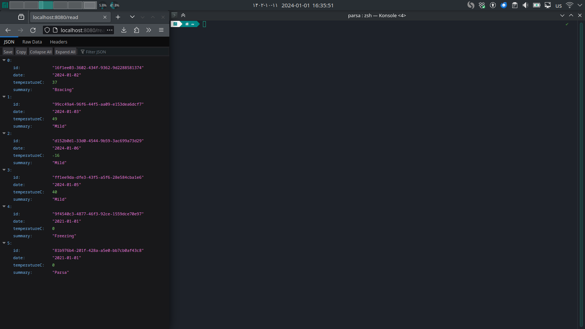

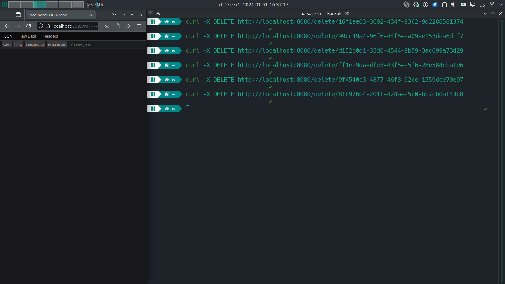

حال به اضافه کردن داده می‌پردازیم.


مشاهده می‌کنیم که سرویس به درستی کار می‌کند.

اگر احیانا فشار روی سرویس زیاد شود، به راحتی می‌توانیم از قابلیت 
load balancing
موجود در 
Docker Compose
استفاده کنیم. برای این منظور هنگام اجرای سرویس از آپشن 
scale
استفاده می‌کنیم. 

البته قبل از این کار باید فایل 
compose.yml
را به گونه‌ای تغییر دهیم که از شبکه 
host
استفاده نکند. چون در این صورت پورت‌ها تداخل پیدا می‌کنند. پس یک شبکه جدید برای کانتینرها تعریف می‌کنیم.

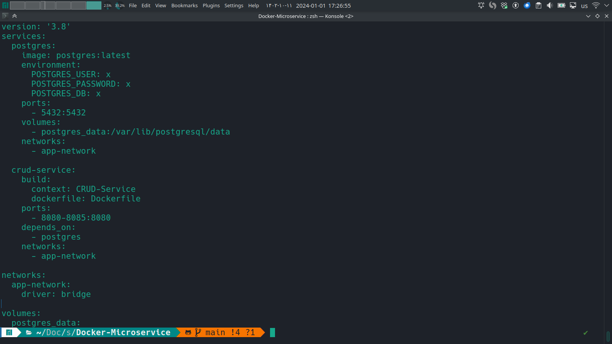

حال با دستور زیر سرویس را اجرا می‌کنیم.

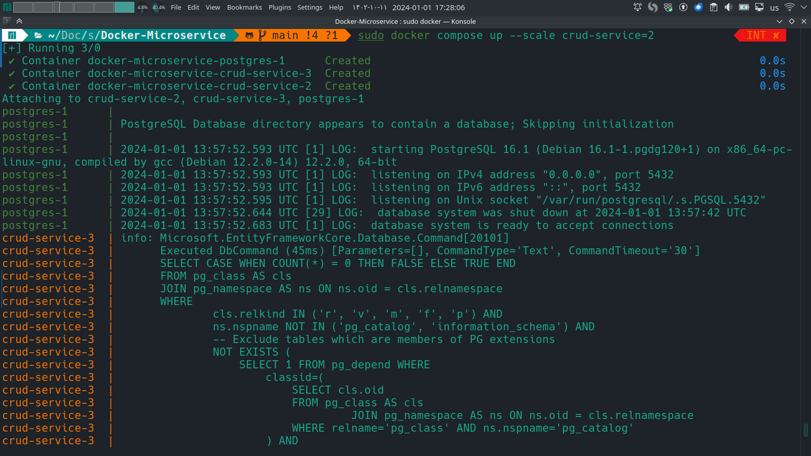

در خروجی لیست کانتینرها مشاهده میکنیم که دو کانتینر برای 
crud-service
وجود دارد. که یکی به پورت 
8084
و دیگری به پورت
8085
بایند شده است. حال مشتری‌ها را بین این دو پورت تقسیم می‌کنیم تا لود سیستم کم شود.

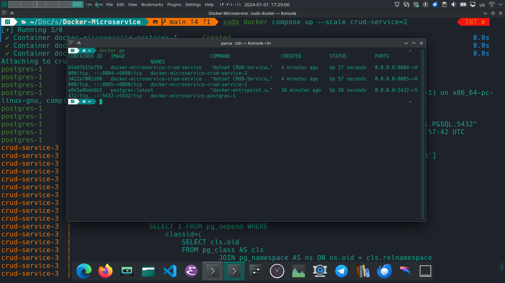

همچنین می‌توانیم با استفاده از 
Docker Swarm
سرویس را روی چندین ماشین اجرا کنیم.

در آخر برای انجام عملیات 
load balancing 
از ایمیج 
nginx
استفاده می‌کنیم. فایل کانفیگ آن در تصویر زیر قابل مشاهده است. 

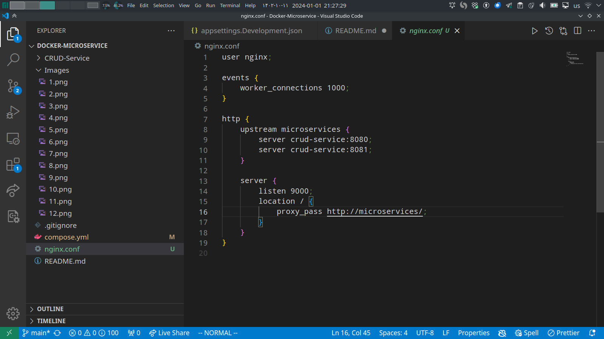

در این فایل ابتدا تعداد تردهای پاسخگو تعیین شده‌اند، سپس گفته شده است در پاسخ به درخواست‌های 
http
درخواست‌ها به لیستی از سرورها که مشخص شده‌اند فرستاده شود. 

فایل 
comopse.yml
هم باید به صورتی تغییر کند که 
nginx 
به آن اضافه شود.

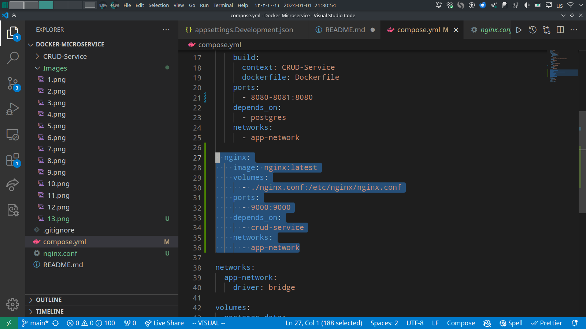

در قسمت زیر اجرا شدن همه سرویس‌ها با هم را مشاهده می‌کنیم.

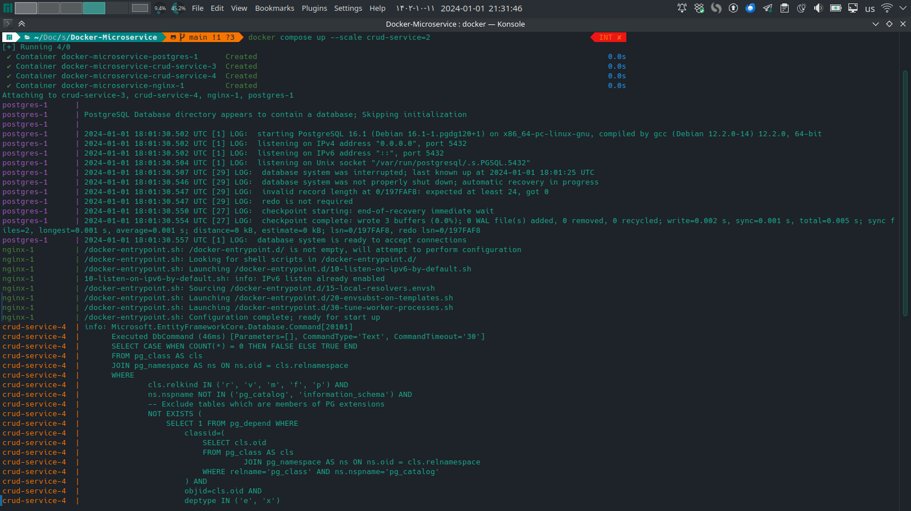
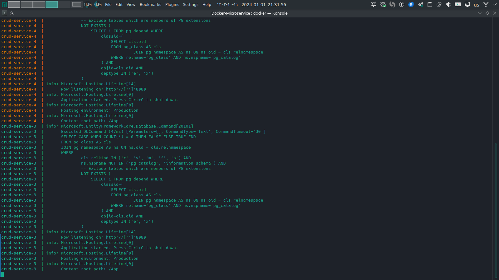

مشاهده می‌کنیم وقتی به 
nginx 
که در پورت
9000
مستقر است درخواست ارسال می‌کنیم به درستی به 
سرویسمان منتقل می‌شود.

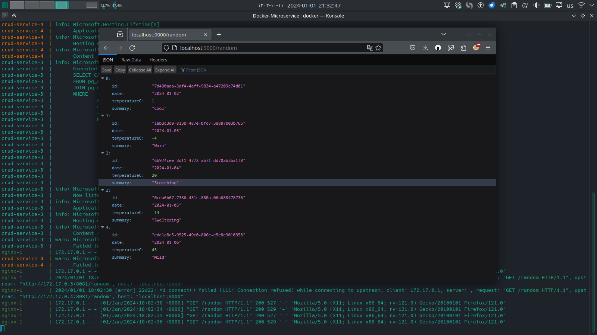

## پرسش‌ها

### بی‌حالت بودن (Statelessness) و کاربرد آن 

**بی‌حالت بودن** در زمینه‌ی میکروسرویس‌ها و برنامه‌های وب به طراحی‌ای اشاره دارد که در آن هر درخواست از کلاینت به سرور باید شامل تمام اطلاعات لازم برای فهم و پردازش درخواست باشد. سرور هیچ حالتی در مورد جلسه کاربری کلاینت روی سمت سرور ذخیره نمی‌کند. این با طراحی **حالت‌دار** که در آن سرور حالت تعامل با کلاینت را در طول چندین درخواست نگه می‌دارد، در تضاد است.

در اینجا چگونگی کاربرد مفهوم بی‌حالت بودن آمده است:

#### استقلال درخواست‌ها
- در معماری میکروسرویس بی‌حالت، هر درخواست مستقل است. این بدان معناست که هنگامی که میکروسرویسی درخواستی را پردازش می‌کند (مانند عملیات CRUD)، این کار را فقط بر اساس اطلاعات موجود در درخواست انجام می‌دهد و به تعاملات قبلی برای تکمیل این فرایند تکیه نمی‌کند.

#### قابلیت مقیاس‌پذیری
- سرویس‌های بی‌حالت راحت‌تر قابل مقیاس‌گذاری هستند. به دلیل اینکه هر درخواست خودکفا است، می‌توان به راحتی درخواست‌ها را بین چندین نمونه از یک سرویس توزیع کرد. این موضوع در این آزمایش که شامل پیاده‌سازی تعادل بار است، بسیار مهم است.

#### طراحی و مدیریت ساده‌تر
- سرویس‌های بی‌حالت ساده‌تر طراحی و مدیریت می‌شوند. نیازی به همگام‌سازی حالت جلسه در چندین سرور یا سرویس وجود ندارد که می‌تواند پیچیده و مستعد خطا باشد.

#### داکر و داکر کامپوز
- هنگام استقرار میکروسرویس‌های خود با استفاده از داکر و داکر کامپوز، بی‌حالت بودن نقش مهمی ایفا می‌کند. از آنجا که هر کانتینری که یک میکروسرویس را اجرا می‌کند، می‌تواند هر درخواستی را به صورت مستقل پردازش کند، ایجاد، نابودی یا تکثیر کانتینرها بر اساس بار بدون نگرانی در مورد حفظ حالت یکنواخت در این کانتینرها آسان است.

#### تعادل بار
- این آزمایش شامل استفاده از تعادل بار برای مدیریت فشار افزایش یافته بر خدمات پس‌زمینه است. سرویس‌های بی‌حالت کاملاً با استراتژی‌های تعادل بار مطابقت دارند، زیرا هر درخواست ورودی می‌تواند توسط هر نمونه‌ای از سرویس پردازش شود، که باعث افزایش کارایی استفاده از منابع و زمان پاسخ می‌شود.

#### تعامل با پایگاه داده
- حتی اگر میکروسرویس‌ها یک پایگاه داده مشترک را به اشتراک می‌گذارند، بی‌حالت بودن به این معنی است که هر پرس و جو به پایگاه داده باید شامل تمام اطلاعات لازم باشد. هیچ وابستگی به پرس و جوهای قبلی یا جلسات وجود ندارد.

به طور خلاصه، با طراحی میکروسرویس‌های خود به گونه‌ای که بی‌حالت باشند، ما اطمینان حاصل می‌کنیم که آن‌ها مستقل، قابل مقیاس‌پذیری و راحت‌تر برای مدیریت هستند که با نیازهای این آزمایش برای مدیریت بهینه بار افزایش یافته و استقرار با استفاده از داکر و داکر کامپوز تطابق دارد.


</div>
