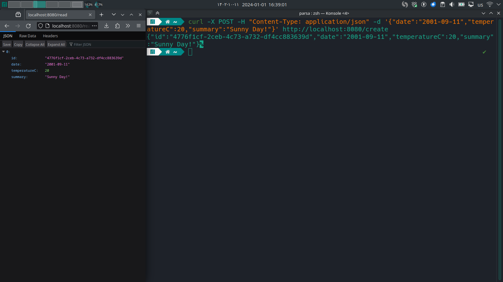

# Docker-Microservice
Deploy a Software with Microservice Architecture via Docker

<div dir="rtl">

## روال انجام آزمایش

ابتدا از نصب بودن داکر بر روی سیستم خود اطمینان حاصل می‌کنیم.


حال با دستور زیر یک پروژه 
Web API
با استفاده از
.NET
ایجاد می‌کنیم.

```bash
mkdir CRUD-Service
dotnet new webapi -o Converter-Service 
```

کدهای مربوطه در این پروژه برای خواندن، نوشتن، بروزرسانی و حذف داده از دیتابیس 
PostgreSQL
نوشته شده‌اند. حال به سراغ 
containerize 
کردن پروژه می‌رویم. برای این کار داکرفایل زیر را می‌نویسیم. 


در این فایل ابتدا با استفاده از ایمیجی که دارای 
DotNet SDK
است، پروژه را بیلد می‌کنیم سپس فایل‌های بیلد شده را به ایمیجی که دارای 
DotNet Runtime
است منتقل می‌کنیم. این کار برای سبک‌تر شدن ایمیج نهایی است. در ادامه باید داکر کامپوز مربوط به این سرویس و دیتابیس را بنویسیم. 


همانطور که مشاهده می‌کنیم ابتدا ورژن کامپوز مشخص شده، سپس قسمت مربوط به دیتابیس را مشاهده می‌کنیم و پس از آن قسمت مربوط به ماکروسرویس اول. در آخر والیوم‌های مورد نیاز معرفی شده‌اند. با دستور زیر کانتینرها را ساخته و اجرا می‌کنیم. 


حال مشاهده می‌کنیم در مرورگر به درستی درخواست ارسال می‌شود. 


در تصویر زیر ایمیج‌ها و کانتینرهای ایجاد شده را مشاهده می‌کنیم. 


برای تست صحت عملکرد میکروسرویس از curl استفاده می‌کنیم. 
ابتدا تمام داده را پاک می‌کنیم.


حال به اضافه کردن داده می‌پردازیم.



مشاهده می‌کنیم که سرویس به درستی کار می‌کند.


</div>